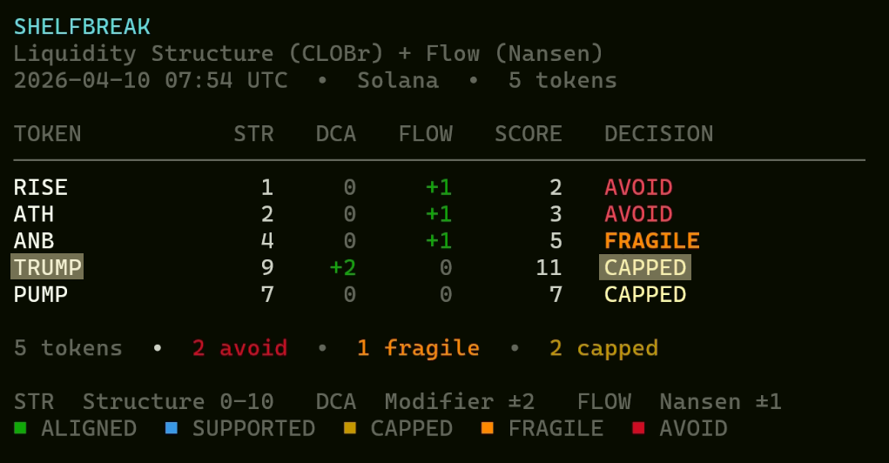
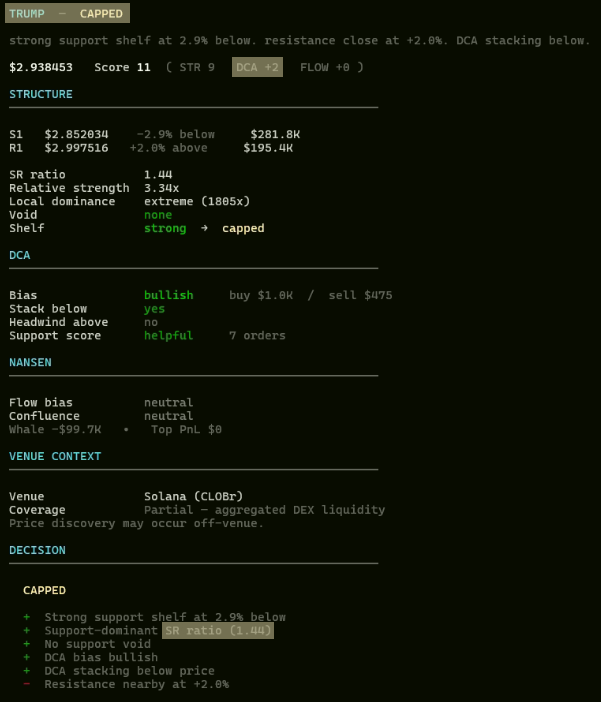
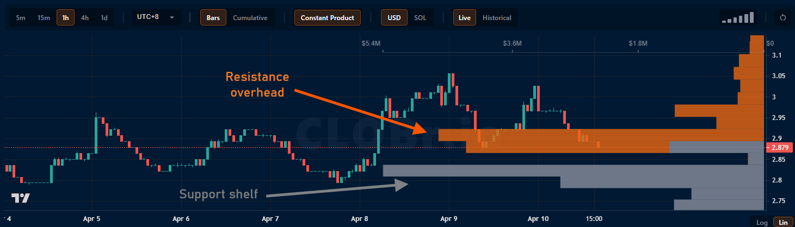

# Shelfbreak

**Find liquidity before price moves.**

Shelfbreak is a lightweight CLI tool that scans tokens for structural setups — where liquidity (support/resistance) is likely to dictate the next move.

Instead of chasing price, Shelfbreak surfaces:

* **Support shelves** (accumulation zones)
* **Resistance caps** (overhead supply)
* **Imbalances** between buyers and sellers

---

## 🔍 What it does

Shelfbreak runs in three steps:

### 1. Scan

Find tokens with interesting structural setups.

```bash
node scan.mjs
```

### 2. Inspect

Break down a specific token:

```bash
node inspect.mjs <token>
```

Outputs:

* Support / resistance levels
* Strength of liquidity zones
* Structural signals (e.g. capped, breakout potential)

### 3. Validate (CLOBr)

Use CLOBr to visually confirm the setup.

Example:

* Resistance sitting above price → **capped**
* Strong support below → **accumulation shelf**

---

## 🧠 Example Insight

Shelfbreak identifies structure, explains it, and validates it visually:

### Scan


### Inspect (TRUMP — CAPPED)


> “DCA strong, but capped”

- Buyers are accumulating below price  
- But heavy resistance sits just overhead  

### Liquidity Structure (CLOBr)


> Resistance overhead limits upside despite accumulation.

**Typical outcomes:**
- Consolidation below resistance  
- Or rejection from overhead supply

---

## ⚙️ How it works

Shelfbreak combines:

* Liquidity structure (CLOBr depth)
* Price-relative positioning
* Simple scoring logic

It focuses on **where orders are**, not just where price has been.

---

## 📦 Project Structure

```
.
├── scan.mjs          # finds candidate tokens
├── inspect.mjs       # analyzes a single token
├── fetch-data.mjs    # pulls market data
├── src/              # core logic
├── test-structure.mjs
```

---

## 🚀 Getting Started

Install dependencies:

```bash
npm install
```

Run a scan:

```bash
node scan.mjs
```

Inspect a token:

```bash
node inspect.mjs TRUMP
```

---

## 🧩 Why this matters

Most tools:

* React to price
* Follow momentum

Shelfbreak:

* Looks at **liquidity first**
* Identifies **constraints on price movement**

It answers:

> *Where can price move — and what’s stopping it?*

---

## 🔮 Roadmap

* Automated CLOBr integration
* Signal alerts (cron / agents)
* Multi-token dashboards
* Integration with Nansen / flow data

---

## 🧪 Status

Early prototype built for hackathon use.

Focus:

* Fast iteration
* Clear signals
* Simple CLI workflow

---

## 🤝 Contributing

Open to ideas, improvements, and integrations.

---

## 📜 License

MIT